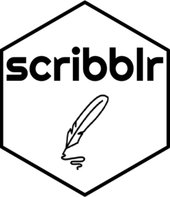

<!-- README.md is generated from README.Rmd. Please edit that file -->

# scribblr 

<!-- badges: start -->

[](https://lifecycle.r-lib.org/articles/stages.html#experimental)
[](https://CRAN.R-project.org/package=scribblr)
[](https://github.com/vgherard/scribblr/actions)
[](https://codecov.io/gh/vgherard/scribblr?branch=master)
[](https://twitter.com/intent/tweet?text=%7Bscribblr%7D:%20A%20Minimalist%20Notepad%20Inside%20RStudio&url=https://github.com/vgherard/scribblr&via=ValerioGherardi&hashtags=rstats,rstudio,productivity)
<!-- badges: end -->

`scribblr` is a project-aware notepad inside RStudio.


## Installation

`scribblr` is not yet available on CRAN. In the meanwhile, you can
install the development version from [my R-universe
repository](https://vgherard.r-universe.dev/), with:

``` r
install.packages("scribblr", repos = "https://vgherard.r-universe.dev")
```

or equivalently from [GitHub](https://github.com/vgherard/scribblr)
with:

``` r
# install.packages("devtools")
devtools::install_github("vgherard/scribblr")
```
